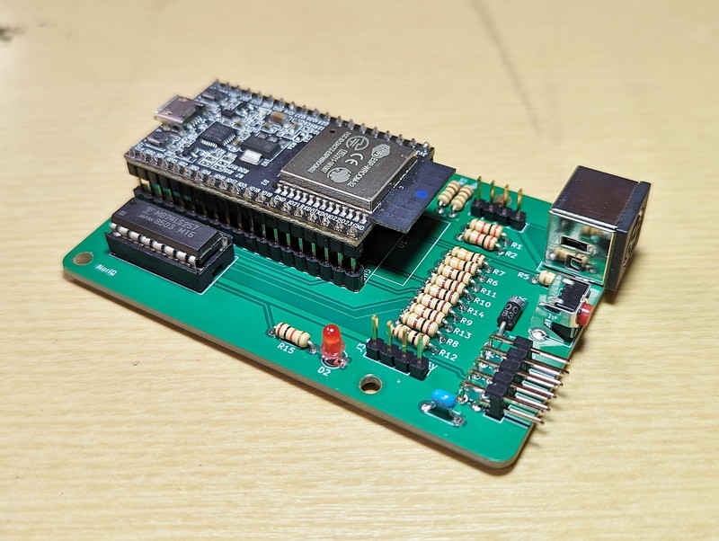

## はじめに
このプロジェクトは、[engineers@work](https://eaw.app/) によって開発された SharpKey Multi HID Interface について、DIY用のPCB基板を設計し、動作/検証をする試みです。

海外のコアな8BitレトロPCファンが日本のユニークな8Bitパソコンを使いこなすために、日夜、解析・研究を行い、今も新しいプロダクトを生み出していることに敬意を表します。

## オリジナル
SharpKey Multi HID Interface のオリジナルプロジェクトについては、下記を参照してください。

* [engineers@work](https://eaw.app/)
* [SharpKey Multi-HID Interface](https://eaw.app/sharpkey/)
* [ユーザーマニュアル](https://eaw.app/sharpkey-usermanual/)
* [テクニカルガイド](https://eaw.app/sharpkey-technicalguide/)
* [GitHub](https://github.com/pdsmart)

## このプロジェクト
このプロジェクトはオリジナルコードからビルド可能な状態に修正を加えたものです。
機能は全てオリジナルに準じます。
また、回路図や基板デザインはDIY可能な設計に置き換えられています。

詳細は下記を参照してください。

[JunkQ yard SharpKeyQ](https://junkqyard.blogspot.com/p/sharpkeyq.html)

## アップデート
2024-02-09 MZ-5665モジュールの対応

2023-11-26 最初のコミット

## ライセンス
オリジナルライセンスに基づき、SharpKey Multi HID Interface の設計、ハードウェアおよびソフトウェアは、GNU Public License v3 に基づいてライセンスされています。

## The Gnu Public License v3
The source and binary files in this project marked as GPL v3 are free software: you can redistribute it and-or modify it under the terms of the GNU General Public License as published by the Free Software Foundation, either version 3 of the License, or (at your option) any later version.

The source files are distributed in the hope that it will be useful, but WITHOUT ANY WARRANTY; without even the implied warranty of MERCHANTABILITY or FITNESS FOR A PARTICULAR PURPOSE. See the GNU General Public License for more details.

You should have received a copy of the GNU General Public License along with this program. If not, see http://www.gnu.org/licenses/.

